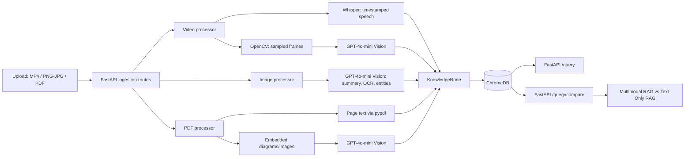

# Weft

**Multimodal data management pipeline for RAG-ready systems.** Weft weaves video, audio, images, PDFs and JSON into one linked, timestamped knowledge graph, so every answer traces back to the exact frame, page or second it came from.

Weft turns videos, images, and PDFs into retrieval-ready knowledge that keeps the evidence users actually need: what was said, what was shown, and where it appeared.

## Overview & Problem Statement

Most RAG pipelines reduce source material to plain text. That loses the architecture diagram on a slide, the OCR text in a screenshot, the page location in a PDF, and the time window in which a speaker explained it.

Weft bridges these gaps by combining speech transcription, sampled video frames, image/PDF OCR-style visual analysis, and document context into a single searchable knowledge layer. Every indexed item carries its source, modality, time range or page locator, extracted frame path, transcript, and visual summary—so retrieval can return grounded multimodal evidence instead of disconnected text fragments.

## Key Architectural Features

- **Time-aligned video understanding:** Whisper produces timestamped transcript segments, OpenCV samples frames on a fixed interval, and GPT-4o-mini Vision describes diagrams, visible text, layouts, and other important visual context. Each video `KnowledgeNode` aligns narration to its frame window.
- **Unified `KnowledgeNode` metadata:** Nodes preserve modality (`video`, `image`, or `pdf`), source filename, timestamp/page locator, frame path, entities, provenance, extracted text, and visual summary.
- **Persistent cross-modal retrieval:** ChromaDB persists the `multimodal_knowledge` collection locally. Its embedding documents combine text/transcript and visual summary for semantic search across modalities.
- **Baseline comparison for judges:** `/query/compare` searches both the multimodal collection and a companion transcript-only collection. This makes the benefit of visual context measurable side by side against Text-Only RAG.
- **Demo-friendly artifacts:** Extracted video frames and PDF visual artifacts are stored under `data/frames/` and exposed at `/frames` for quick inspection.

## Architecture



## Ingestion Pipeline

| Modality | What is extracted | Segment unit |
| --- | --- | --- |
| Video | Whisper speech with per-sentence timestamps and confidence; scenes detected from visual change; one keyframe per scene described by Gemini (summary, OCR blocks and regions with bounding boxes, typed entities); repeated slides reuse the earlier analysis | One window per scene, long scenes split at sentence boundaries (max 30 s) |
| Audio | Whisper speech with confidence | One per Whisper segment |
| Image | Gemini description, OCR text, OCR blocks and regions with bounding boxes, typed entities | One per image |
| PDF | Exact text layer + Gemini analysis of the rendered page (OCR used for scanned pages) | One per page |
| JSON / TXT | Records as given | One per record |

Enrichment after extraction:

- **Speakers** (audio/video): Gemini labels each speech segment with a speaker and resolves a name only when the recording states it. Stored as `spoken_by` edges to `person` (named) or `speaker` (unnamed, per recording) entities.
- **Entities**: typed entities from spoken/written text (Gemini, batched; pattern-based fallback without a key, stored with lower mention confidence).

Derived files (keyframes, page renders) are written to `data/derived/{source_id}/` and served at `/derived/...`, so uploads never overwrite each other. Identical files are detected by SHA-256 and not re-processed (`?force=true` overrides). Add `?background=true` to any `/upload/*` call to get `202` with a `job_id` and poll `GET /jobs/{id}`; unfinished jobs resume after a restart.

## Knowledge Model

SQLite (`data/knowledge.db`) is the system of record; ChromaDB is only an
index over segment IDs and can be rebuilt from SQLite at any time.

| Table | What it holds |
| --- | --- |
| `sources` | One row per uploaded asset: filename, modality, SHA-256, size, storage key, index status. |
| `segments` | One row per unit of evidence (video window, speech span, PDF page, image, JSON record): text, visual summary, locator (start/end seconds, page, image region, label), frame path, confidence, extractor. |
| `entities` | Named concepts, deduplicated across files by a normalized name (`checkout-service` = `Checkout Service`). |
| `relations` | Typed, directed, confidence-weighted edges with the reason they exist: `mentions`, `spoken_by` and `next` from ingestion; `co_occurs`, `shows_same`, `depicts`, `corroborates` and `same_as` from the cross-modal linker (see below). |

Confidence is the extractor's own value when one exists (Whisper: `exp(avg_logprob) × (1 − no_speech_prob)`;
video windows average speech and vision), otherwise a per-extractor prior (structured input 1.0, PDF text layer 0.9, Whisper 0.85,
Whisper+vision 0.8, vision OCR 0.75), lowered when a vision call failed.

Maintenance:

```bash
python -m app.cli stats           # counts per table / modality / relation
python -m app.cli import-legacy   # copy data from the pre-SQLite Chroma collection
python -m app.cli reindex         # rebuild the Chroma index from SQLite
python -m pytest tests            # unit + API + Chroma integration tests
```

## Cross-Modal and Temporal Links

After every ingest, `app/services/linker.py` connects the new segments to the rest of the graph:

| Relation | Meaning | How it is decided |
| --- | --- | --- |
| `co_occurs` | Two windows of the same video scene: different speech while the same visual was on screen | Same scene index |
| `shows_same` | A slide or frame shown again later in the recording | Perceptual-hash duplicate keyframe |
| `depicts` | A visual segment (diagram, screenshot, slide, page render) illustrates what a speech/text segment in another source says | Shared entities and/or embedding similarity; the side with visual evidence is the source of the edge |
| `corroborates` | Two segments in different sources state the same thing | Same signals, both sides textual (or both visual) |
| `same_as` | Two entities are the same thing under different surface forms | Normalized name, leading article dropped, last word singularized |

A pair is linked when it shares at least two entities (after `same_as` resolution), or one entity plus cosine similarity ≥ 0.42, or similarity ≥ 0.62 alone; each segment keeps its five strongest links. Every edge stores its shared entities, similarity and method, so the evidence panel can show *why* two pieces of evidence are connected.

**Time.** Pass `recorded_at` (ISO 8601) on any `/upload/*` call to place a source in time; otherwise its upload time is used. `GET /entities/{id}/timeline` returns every mention of an entity and its aliases in time order, which is how questions like "how did the p99 latency change" are answered from evidence. The workspace shows this as the Timeline tab on each entity.

`python -m app.cli relink` (or `POST /graph/relink`) recomputes every link, e.g. after tuning thresholds.

## Retrieval

`POST /query` runs `app/services/retrieval.py`:

1. **Decompose** multi-part questions ("what was decided, who explained it, and where was the diagram shown?") into sub-questions; later parts that use a pronoun or are too thin to stand alone ("what were the results?") inherit the first part's topic.
2. **Search three ways** per (sub-)question: dense embeddings over text + visual descriptions (Chroma), BM25 keyword search over text, visual descriptions, OCR, entity and speaker names (SQLite FTS5, catches exact identifiers like `max_retries=5` or `ticket #4471`), and entity matching (entities named in the question, including `same_as` variants).
3. **Fuse** with reciprocal rank fusion, then fuse again across sub-questions.
4. **Expand along the graph**: the top hits pull in `depicts`, `co_occurs`, `shows_same` and `corroborates` neighbours with a decayed score, recording which hit and relation brought them in.
5. **Weight by extraction confidence**, keep at most three hits per source, and attach precise provenance: the best-matching sentence (own timestamp and speaker) inside a video window, and the matching OCR blocks (bounding boxes) on an image or page.

Each result carries its `score`, per-retriever ranks (`signals`), `via` (graph link, if any), `matched_span` and `matched_regions`; the answer layer receives the same, so it can name speakers and say where something was shown. `hybrid`, `expand` and `decompose` can be switched off per request for comparisons; `modalities` filters results.

## Evaluation

`app/evaluation/` scores Weft against a text-only RAG baseline on a gold question set whose evidence is known in advance.

- **Gold set** (`app/evaluation/datasets/demo.json`): 24 questions over the sample corpus, each listing the evidence an answer *requires* (source + page, time range, or record) and evidence that is *also relevant*. Types: `cross_modal` (needs speech + slide + chart), `multi_part`, `visual_only` (the answer is only on a slide or chart), `exact_identifier` (`max_retries=5`, `ticket #4471`) and `text`.
- **Hard distractors** (`distractors.json`): look-alike sources (another postmortem with `max_retries=3`, an older onboarding spec, unrelated dashboards and tickets) so top-k is not trivially the whole corpus.
- **Isolation**: every run builds a fresh temporary SQLite + Chroma corpus; your library is never touched.
- **Systems** (an ablation, each adding one layer): text-only RAG (transcripts and page text only) → dense over text + visual descriptions → hybrid (dense + BM25 + entities) → full Weft (hybrid + decomposition + graph expansion).
- **Metrics** at k: Recall@k (required evidence found), Complete@k (*all* required evidence found, the cross-modal bar), MRR, nDCG@k, precision@k, modality coverage, p50 latency; with `--answers`, answer term coverage for the baseline and Weft.

```bash
python -m app.evaluation run --k 5 --markdown EVALUATION.md   # writes data/eval/latest.json + a Markdown report
python -m app.evaluation run --k 3 --systems text_rag weft
python -m app.evaluation run --answers                         # also synthesizes answers (uses Gemini if configured)
```

The **Evaluate** page in the workspace runs the same thing and shows the system × metric table, Complete@k per question type, and, per question, which required evidence each system found or missed (and whether it came through a graph link). `GET /eval/latest` and `POST /eval/run` expose it over HTTP.

Generate the numbers on your machine with the real embedding model (Chroma's MiniLM). Reports made with the test-only hashing embedding are labelled as proxies in the UI and should not be quoted.

## API Endpoints

| Endpoint | Purpose |
| --- | --- |
| `POST /upload/video` | Upload an MP4, transcribe it, sample frames, generate visual summaries, and index aligned video nodes. |
| `POST /upload/audio` | Upload an audio file, transcribe it, and index timestamped transcript nodes. |
| `POST /upload/image` | Upload a PNG/JPEG, generate a visual summary, OCR-style text extraction, entities, and index one image node. |
| `POST /upload/pdf` | Upload a PDF, extract page text and embedded visual artifacts, and index one node per page. |
| `POST /upload/json` | Upload a JSON file — a single object or an array of `{text/content, locator, source, entities}` records — and index one node per record. For structured data you already have (tickets, logs, metadata) that doesn't need OCR/ASR/vision. |
| `POST /query` | Hybrid, graph-expanded retrieval with a grounded answer; options `hybrid`, `expand`, `decompose`, `modalities`. |
| `POST /query/compare` | Compare the top multimodal result with the top transcript-only baseline result. |
| `GET /entities/{id}/timeline` | Every mention of an entity (and its aliases) ordered by `recorded_at` / upload time and position. |
| `GET /eval/latest`, `POST /eval/run` | Latest evaluation report, or run the gold set (`{dataset, k, systems}`) against an isolated corpus. |
| `GET /graph/{node_id}?depth=1` | Neighbourhood of a segment or entity: nodes and typed, weighted edges. |
| `POST /graph/relink` | Recompute all cross-modal and temporal links. |
| `GET /jobs`, `GET /jobs/{id}` | Background ingestion jobs: status, stage, progress, warnings, result. |
| `GET /stats` | Counts of sources, segments, entities and relations by modality/type. |
| `GET /sources`, `GET /sources/{id}` | List sources, or one source with all its segments. |
| `DELETE /sources/{id}` | Remove a source, its segments, edges and vectors. |
| `GET /segments/{id}` | One segment with its source, mentioned entities and every relation. |
| `GET /entities?q=`, `GET /entities/{id}` | Entities with mention/source/modality counts, or every segment mentioning one. |
| `GET /frames/{filename}` | Preview extracted video or PDF image artifacts during a demo. |
| `GET /docs` | Explore the interactive FastAPI/OpenAPI documentation. |

## Try it instantly with the bundled sample data

`test_data/samples/` ships real video/audio/image/pdf/json files for one
consistent test scenario, split across modalities on purpose — see
[`test_data/samples/README.md`](test_data/samples/README.md). No downloads,
recording, or API keys required to get a first result:

```bash
python test_data/seed_cross_modal_demo.py      # seeds equivalent knowledge directly, no keys needed
python test_data/test_cross_modal_query.py     # asserts retrieval + answer actually span modalities
```

Or, with `.env` configured and the server running, exercise the real
pipeline end to end:

```bash
uvicorn main:app --reload &
python test_data/upload_samples.py             # uploads every sample through /upload/*, then runs the demo query
```

### Example semantic query

```bash
curl -X POST http://127.0.0.1:8000/query \
  -H "Content-Type: application/json" \
  -d '{"query":"Where is the event-driven architecture shown?", "limit":5}'
```

Results include the spoken transcript, GPT-4o-mini visual summary, timestamp or page locator, extracted frame path, source filename, modality, similarity score, and distance.

### Compare multimodal retrieval with the baseline

```bash
curl -X POST http://127.0.0.1:8000/query/compare \
  -H "Content-Type: application/json" \
  -d '{"query":"Which diagram shows the gateway?", "limit":5}'
```

```json
{
  "query": "Which diagram shows the gateway?",
  "multimodal_result": {
    "transcript": "...",
    "visual_summary": "The frame shows an API gateway in front of event consumers.",
    "timestamp": "00:10 - 00:20",
    "frame_path": ".../data/frames/frame_00_10.jpg",
    "source": "architecture-demo.mp4",
    "modality": "video",
    "similarity_score": 0.82,
    "distance": 0.18
  },
  "text_only_baseline_result": {
    "transcript": "...",
    "visual_summary": null,
    "timestamp": "00:40 - 00:50",
    "frame_path": "...",
    "source": "architecture-demo.mp4",
    "modality": "video",
    "similarity_score": 0.51,
    "distance": 0.49
  }
}
```

## Setup & Quickstart

### 1. Create and activate a virtual environment

```bash
python -m venv .venv
```

Windows PowerShell:

```powershell
.\.venv\Scripts\Activate.ps1
```

macOS/Linux:

```bash
source .venv/bin/activate
```

### 2. Install dependencies

```bash
pip install -r requirements.txt
```

### 3. Configure OpenAI credentials

Create a `.env` file in the repository root:

```dotenv
OPENAI_API_KEY=your_api_key_here
```

The API key is used for Whisper transcription and GPT-4o-mini Vision analysis. ChromaDB data is stored locally in `./chroma_db`.

### 4. Start the API

```bash
uvicorn main:app --reload
```

Then open:

- `http://127.0.0.1:8000/` for the landing page
- `http://127.0.0.1:8000/app` for the workspace: **Ask** (grounded answers with citations, evidence drawer that opens video/audio at the cited second and outlines OCR regions on images and pages, optional side-by-side with text-only RAG), **Library** (drag-and-drop uploads as background jobs with live progress, source timelines, delete) and **Entities** (where each person, system or metric appears across files and modalities). With an empty library, **Load sample data** seeds the bundled demo scenario; disable it on public deployments with `ENABLE_DEMO=false`.
- `http://127.0.0.1:8000/docs` for the interactive API reference Extracted frames are previewable under `http://127.0.0.1:8000/frames/`.

## Future Improvements

- **Temporal knowledge graphs:** connect people, concepts, frames, pages, and transcript segments as explicit time-aware relationships.
- **Real-time streaming ingestion:** process live audio/video incrementally and make partial knowledge searchable before an upload completes.
- **Custom chunking policies:** support modality-aware chunk boundaries, scene changes, speaker turns, page sections, and domain-specific document structure.

## Judge Demo Checklist

1. Upload a short architecture/video walkthrough with narration and slides.
2. Query for a concept visible in a diagram.
3. Open the returned frame under `/frames` and verify the timestamped evidence.
4. Run the same query through `/query/compare` to show why transcript-only retrieval misses visual context.
